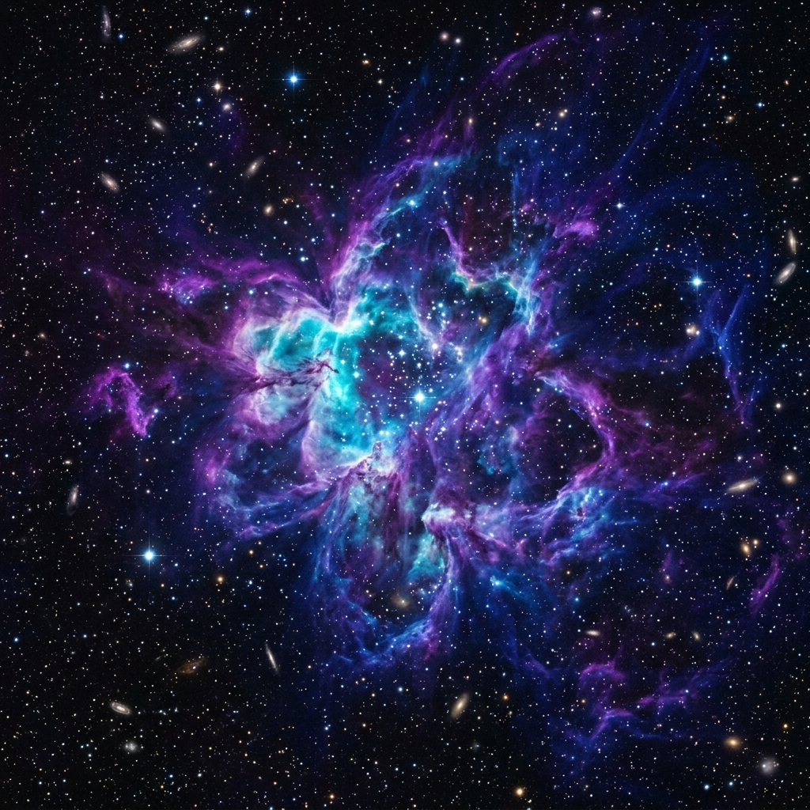

# 🚀 NovaStream | Cosmic Voyager Dashboard

NovaStream is a premium, high-impact space exploration dashboard built purely with core web technologies. It features a cutting-edge **Glassmorphic** aesthetic, real-time data simulation, and a responsive Bento-style layout designed for the next generation of space voyagers.



## ✨ Features

- **Glassmorphism UI**: High-end visual design using advanced CSS `backdrop-filter` and semi-transparent layers.
- **Dynamic Mission Control**: Live-updating vessel telemetry including velocity and distance from Earth.
- **Planetary Atlas**: Interactive orbital data cards featuring custom 3D-rendered celestial bodies.
- **Cosmic Intel Feed**: Real-time simulated news stream for astronomical events and mission updates.
- **System Integrity HUD**: A custom Canvas-powered circular health meter for vessel subsystems.
- **Responsive Bento Layout**: A modular, adaptive grid that maintains premium aesthetics across mobile, tablet, and desktop devices.
- **Micro-animations**: Smooth staggered entry animations, rotating planetary models, and status pulse indicators.

## 🛠️ Tech Stack

- **HTML5**: Semantic structure for SEO and accessibility.
- **CSS3**: Custom variables, Grid/Flexbox, Keyframe animations, and Glassmorphism effects.
- **Vanilla JavaScript**: DOM manipulation, Canvas API, and real-time data simulation.
- **Lucide Icons**: Premium vector iconography for a technical HUD feel.
- **Google Fonts**: Inter and Outfit for modern, clean typography.

## 📁 Project Structure

```text
novastream-space-dashboard/
├── assets/
│   ├── bg.png         # High-resolution cosmic nebula background
│   └── planet.png     # 3D-rendered planetary asset (Mars)
├── index.html         # Main entry point and semantic structure
├── styles.css         # Design system and glassmorphic styling
├── scripts.js         # Interactivity and real-time HUD logic
└── README.md          # Project documentation
```

## 🚀 Getting Started

No installation or build steps are required. NovaStream is built with pure web standards.

1. Clone or download the repository.
2. Open `index.html` in any modern web browser (Chrome, Firefox, Safari, Edge).
3. Experience the cosmic interface!

## 🪐 Future Roadmap

- [ ] **Live NASA API Integration**: Fetch real astronomy images and asteroid data.
- [ ] **Interactive 3D Star Map**: Integration with Three.js for a full spatial explorer.
- [ ] **Mission Planner**: A drag-and-drop tool for configuring deep-space trajectories.
- [ ] **Dark/Light Mode Toggle**: Celestial vs. Solar themes.


